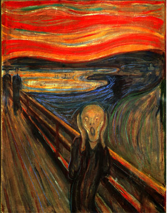
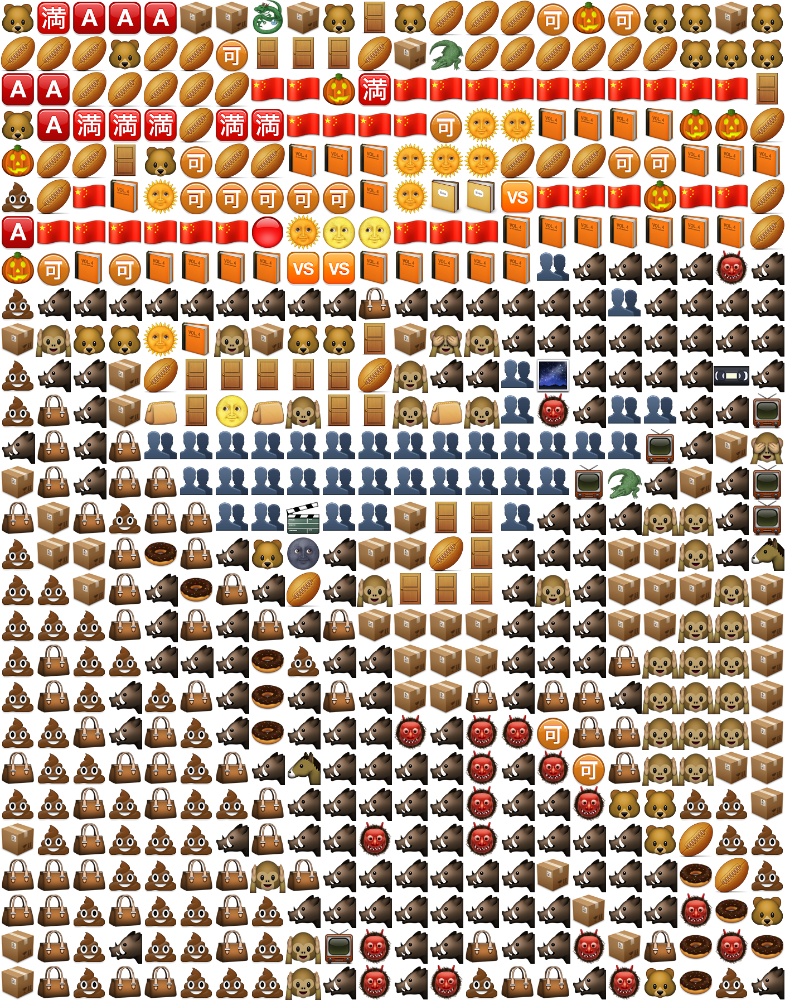
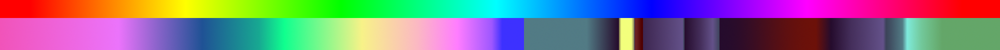
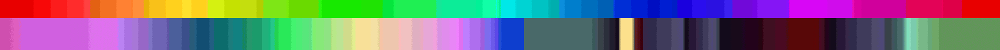

Emotim
======

Library and program to convert normal images into emoticon versions by replacing chunks of the original image with emoticons of similar color.

Example
-------

Original:  

Emotoconized:  

As text:  
🐻🈵🅰🅰🅰📦📦🐉📦🐻🚪🐻🏉🏉🏉🉑🎃🉑🐻🐻📦🐻  
🏉🏉🏉🐻🏉🏉🉑🚪🚪🚪🏉📦🐊🏉🏉🏉🏉🏉🏉🐻🐻🐻  
🅰🅰🏉🏉🏉🏉🏉🇨🇳🇨🇳🎃🈵🇨🇳🇨🇳🇨🇳🇨🇳🇨🇳🇨🇳🇨🇳🇨🇳🇨🇳🇨🇳🚪  
🐻🅰🈵🈵🈵🏉🈵🈵🇨🇳🇨🇳🇨🇳🇨🇳🉑🌞🌞📙📙📙📙🎃🎃🏉  
🎃🏉🏉🚪🐻🉑🏉🏉📙📙📙🌞🌞🌞🏉🏉🏉🉑🉑📙📙📙 
💩🏉🇨🇳📙🌞🉑🉑🉑🉑🉑📙🌞📔📔🆚🇨🇳🇨🇳🇨🇳🎃🇨🇳🇨🇳🏉 
🅰🇨🇳🇨🇳🇨🇳🇨🇳🇨🇳🇨🇳🔴🌞🌝🌝🇨🇳🇨🇳🇨🇳📙📙📙📙📙📙📙🏉 
🎃🉑📙🉑📙📙📙📙🆚🆚📙📙📙📙📙👥🐗🐗🐗🐗👹🐗 
💩🐗🐗🐗🐗🐗🐗🐗🐗🐗👜🐗🐗🐗🐗🐗🐗👥🐗🐗🐗🐗 
📦🙉🐻🐻🌞📙🙉📦🐻🐻🚪📦🙈🙉🐗🐗🐗🐗🐗🐗🐗🐗 
💩🐗🐗📦🏉🚪🚪🚪🚪🚪🏉🙉🐗🐗👥🌌🐗🐗🐗🐗📼🐗 
💩👜🐗📦👝🚪🌝👝🙉🚪🚪🙉👝🙉👥👹🐗👥👥🐗🐗📺 
🐗👜🐗👜👥👥👥👥👥👥👥👥👥👥👥👥👥👥📺🐗📦🙈 
📦👜🐗👜👜👥👥👥👥👥👥👥👥👥👥👥📺🐊🐗📦🐗📺 
👜📦👜💩👜👜👥👥🎬👥👥📦🚪🚪👥🐗🐗🐗🙉🙉🐗📺 
💩📦📦👜🍩👜🐗🐻🌚🐗📦📦🏉🚪🐗🐗🐗📦📦🙉🐗🐴 
💩💩📦👜🐗🍩👜🐗🏉🐗🙉🚪🚪🚪🐗🙉🐗📦📦📦🙉📦 
💩💩💩👜🐗👜🐗👜🐗👜📦📦📦📦🐗🐗🐗📦📦🙉🙉📦 
💩👜💩💩🐗🐗🐗🍩💩🐗🐗📦📦📦🐗🐗🐗👜🙉🙉🙉📦 
💩👜💩🐗💩👜🐗🍩🐗👜🐗📦📦👜🐗👜👜🐗🙉🙉🙉📦 
💩💩👜🐗👜💩🐗🍩🐗🐗🐗👹🐗👹👹🉑👜👜🙉🙉🙉📦 
👜💩💩👜👜💩👜🐗🐴🐗🐗🐗🐗👹🐗👹🉑👜🙉🙉📦📦 
💩💩👜💩👜💩💩👜🐗🐗🐗🐗🐗👹🐗🐗👹🐻🐻💩💩📦 
📦💩👜💩💩💩🐗👜🐗🐗👹🐗🐗👹🐗🐗🐗🐗🐻🏉💩💩 
👜👜👜💩💩👜👜🙉👜🐗🐗🐗🐗🐗🐗📦🐗🐗🐗🍩🏉💩 
👜👜💩👜💩💩👜💩🐗🐗🐗🐗🐗🐗🐗🐗📦🐗🐗👹🍩🐻 
📦👜💩🐗💩💩👜💩🙉📺👹🐗🐗👜🐗🐗👹📦👜🍩👹🍩 
📦👜💩👜👜💩💩💩🙉🐗👹🐗👹💩👜👜🐗👹🐻🍩💩🐗 

How does it work?
-----------------

The idea is to compare little squares of the input image with all emoticons and select the best fitting
emoticon for that square.

The programm first reads in all emoticons. It then converts the color space. A color space describes how a certain color is represented with numbers. Normal images use RGB color space with respectively one numerical percentage value for the red, one for the green and one for the blue portion of a pixel. (And one additional number called alpha for the transparency) . The emoticons are transfered into HCL color space. Instead of red, green and blue, it uses the metrics color angle (H, hue), chroma (C, similar to saturation of the color) and lightness (L). This allows to calculate the distance of colors.

The conversion is not looseless. The first image is the original image, the second one converted to HCL and back.

For input image to emoticon comparisation, it wants to create a histogram of each emoticon and each square of the input image. Those histograms are later compared. A histogram indicates how often each color appears in an image. Since the pixel is made out of 3 numbers that range from 0 to 255, there is a total of 255^3 = 16581375 (16 million) colors. That is way to much. On the one hand, it consumes much computer memory and cpu time when iterating over all possible colors, on the other hand that 3d matrix histogram would consist mostly of zeros with spare ones in it. (2000^2 / 255^3 = 25%) An image with 2000 times 2000 pixels would leave more than 75% of the histogram empty. By the way, histograms in photoshop or on digital camera screens show much smaller histograms. But these histograms are useless, since they only iterate over lightness or one single color. Such histograms could not distinguish between an image with a distinct green and distinct red area and an image with one single yellow area.

So the idea is to reduce the color depth, that means the number of different possible values for one metric. Lightness can range from 0 to 255 in a full depth representation, but only from 0 to 15 in a reduced depth representation. (0->0, 255->15)

This leaves a total of 16^3 = 4096 distinct colors.

Reduced depth:

For each emoticon and each little square in the input image, the programm calculates the 3d histogram of the reduced depth version. It then smoothes the histogram using a 3d gaussian kernel. Now it only needs to compare the histograms. I implemented two different algorithms.

The first one is simple histogram correlation. The emoticon with the highest correlation is chosen. This gives quite good results (see example from above) but it takes time (maybe 10 seconds per 1000^2 pixel image). The only problem here is that a mostly red emoticon is chosen for black areas in the input image.

The second alorithm searches for local maxima in the histogram. It saves the extend of the maxima and the color (that means the position within the histogram) in a list. Afterwards only the maxima are compared. A color similarity is calculated for each combination of maxima. For a prior version of this repository, this worked better than now. I tried to apply some color similarity method I found in a paper, but then changed the formulas. Now it is all messed up. There is stuff to work on here, but since I am not doing any competition here I will leave it as it is. This maxima method is much much faster (feels like instant) than the correlation method.

